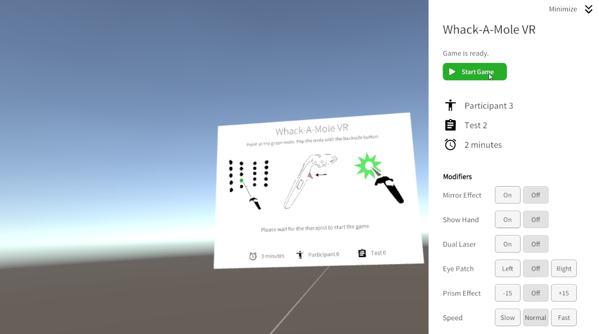
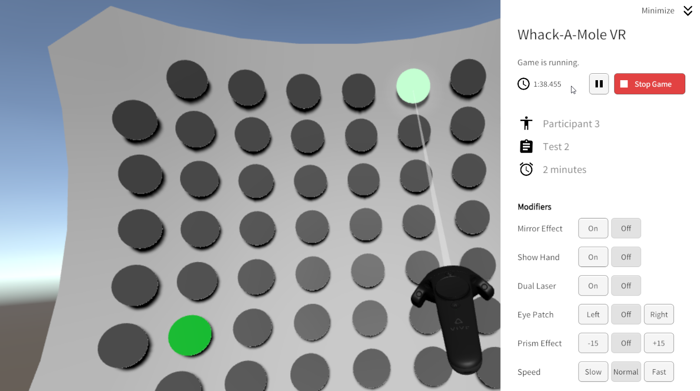

# Whack-A-Mole VR Game made with Unity

The Whack_A_Mole VR environment provides a test for the Pupil Labs Calibration environment, used with the Pupil Labs plugin for eye-tracking in VR. 

The main goal of this project is to be used in clinics for rehabilitation of visualy neglected people. By providing a playful environment, the game stimulates the patient and helps his rehabilitation, while data are collected in the background to allow for a deep analysis of the patient behavior and reactions.

The game is a simple Whack-a-mole, but in VR. In the VR environment, the participant is presented a wall on which are multiple moles (represented by gray disks). When the game starts, random moles will activate by changing their color to green and emitting a sound. The participant will then need to pop the moles before they deactivate by themselves. There are also fake moles, which activates with the red color and that the patient musn't pop.

The environment provides many features to customise the game, with multiple parameters and modifiers:

- Logging parameters: 
  - Participant ID: allows to keep track of the participant for data analysis (across sessions)
  - Test ID: allows to keep track of the test number for data analysis

- Game modifiers: 
  - Game duration: allows to set the duration of the game
  - Game speed: allows to set the speed of the game between three options (slow, normal, fast). The higher the speed, the more moles will spawn and the higher the fake moles's spawn coefficient will be
  - Mirror effect: mirrors the patient's VR controller's position and rotation. All his movements will be reversed except the ones on the vertical axis
  - Show hand: replaces the VR controller model with a hand model (not implemented yet)
  - Dual laser: allows the participant to use both controllers (left and right) at once
  - Eye patch: applies an eye patch. Disables one of the participant's eye in the VR headset. Can be set to either left, right or none
  - Prism effect: applies an offset on the participant's VR controller, meaning that the position of the VR controller between the real world and in-game will differ

Many data are collected through a single game. They are by default saved to a dedicated CREATE database, but it is also possible to save them locally as a .CSV file. They can be then visualised using a dedicated R-shiny application available at this link: https://github.com/QuentinDaveau/Whack_A_Mole_RShiny. 

## Mole Whacking Data Collection

This application logs various game datas, from the activated mole position to the position travelled by the participant's laser between two mole poping. The logs are by default saved in the application main directory, however a custom path can be set from the Unity editor. These data are logged when specific events occurs.

The events are:

* **Game Started**: raised when a game is started
* **Game Paused**: raised when the running game is paused
* **Game Finished**: raised when the game finishes (the game timer reaches 0)
* **Game Stopped**: raised when the game is manually stopped
* **Game Speed Changed To** (Slow, Normal, Fast): raised when the game speed is changed
* **Mirror Effect Set** (True, False): raised when the mirror effect modifier is changed
* **Dual Task Set** (True, False): raised when the dual task modifier is changed
* **Prism Effect Set** (-15, 15, float value): raised when the prism effect modifier is changed
* **Eye Patch Set** (Left, Right, None): raised when the eye patch modifier is changed
* **Mole Spawned**: raised when a Mole is activated
* **Fake Mole Spawned**: raised when a Fake Mole (Distractor) is activated
* **Mole Hit**: raised when an activated Mole is hit
* **Fake Mole Hit**: raised when an activated Fake Mole (Distractor) is hit
* **Expired Mole Hit**: raised when an expired Mole (which just deactivated) is hit
* **Mole Expired**: raised when a Mole deactivates without being hit
* **Fake Mole Expired**: raised when a Fake Mole (Distractor) deactivates without being hit
* **Pointer Shoot**: raised when the laser is shot
* **Mole Missed**: raised when a shot didn't hit any Mole

The logged data are:

* **Email**: the email of the selected profile
* **Date**: the date in the yyyy-mm-dd normalized format
* **Time**: the time in the hh:mm:ss normalized format
* **TimeStamp**: a time stamp in the yyyy-mm-dd hh:mm:ss.mmm format referencing the instant a given event happened
* **ParticipantId**: the ID of the participant, corresponding to a number set by the Therapist before launching the game
* **TestId**: the ID of the test, corresponding to a number set by the Therapist before launching the game
* **GameId**: a unique ID given to the current game
* **PlayedPattern**: the pattern being played
* **Event**: the name of the event raised
* **EventType**: the type of the event. Can be a GameEvent, a MoleEvent, a PointerEvent or a ModifierEvent
* **TimeSinceLastEvent**: the time spend between this event and the previous one
* **GameState**: the current state of the game (e.g. Game Paused)
* **GameSpeed**: the current speed of the game (e.g. Fast)
* **GameDuration**: the duration in seconds of the game
* **GameTimeSpent**: the time spent since the game started
* **GameTimeLeft**: the time left before the current game ends
* **RightControllerMain**: is the right controller the main controller (e.g. True, False)
* **MirrorEffect**: is the mirror effect modifier activated (e.g. True, False)
* **EyePatch**: the eye patch position (e.g. Left, Right, None)
* **PrismEffect**: is the prism effect activated (e.g. True, False)
* **DualTask**: is the dual task activated (e.g. True, False)

* **MoleId**: the unique ID of the mole, being a four digits number
* **MoleIndexX**: the X index of the mole
* **MoleIndexY**: the Y index of the mole
* **MolePositionWorld** (X, Y, Z): the world position of the mole concerned by the event, separated in three parameters for each axis
* **MolePositionLocal** (X, Y, Z): the local position of the mole concerned by the event, separated in three parameters for each axis
* **MoleLifeTime**: the duration the mole will stay activated
* **MoleActivatedDuration**: the time the mole spent activated before deactivating/being poped
* **CurrentMoleToHitId**: the unique ID of the current mole to hit, being a four digits number
* **CurrentMoleToHitIndexX**: the X index of the current mole to hit
* **CurrentMoleIndexY**: the Y index of the current mole to hit
* **CurrentMolePositionWorld** (X, Y, Z): the world position of the current mole to hit, separated in three parameters for each axis
* **CurrentMolePositionLocal** (X, Y, Z): the local position of the current mole to hit, separated in three parameters for each axis
* **ClosestActiveMoleDistance** (X, Y): the global position of the closest active Mole, on the X and Y axis

* **ControllerSmoothed**: if the movement of the controller's lazer is somoothed or not
* **ControllerAimAssistState**: the aiming assistance used
* LastShotControllerRawPointingDirection (X, Y, Z): the pointing direction of the last lazer shot without filtering (aim assistance or smoothing)*
* LastShotControllerFilteredPointingDirection (X, Y, Z): the pointing direction of the last lazer shot with filtering (aim assistance or smoothing)*
* (Right, Left) **ControllerPosWorld** (X, Y, Z): the world position of the right/left controller, separated in three parameters for each axis
* (Right, Left) **ControllerPosLocal** (X, Y, Z): the local position of the right/left controller, separated in three parameters for each axis
* (Right, Left) **ControllerRotEuler** (X, Y, Z): the rotation in euler angles of the right/left controller, separated in three parameters for each axis
* (Right, Left) **ControllerPosTravel** (X, Y, Z): the total distance that the right/left controller travelled since the last time this parameter was logged, separated in three parameters for each axis
* (Right, Left) **ControllerRotTravel** (X, Y, Z): the total angle that the right/left controller travelled since the last time this parameter was logged, separated in three parameters for each axis
* **HeadCameraPosWorld** (X, Y, Z): the world position of the head camera, separated in three parameters for each axis
* **HeadCameraPosLocal** (X, Y, Z): the local position of the head camera, separated in three parameters for each axis
* **HeadCameraRotEuler** (X, Y, Z): the rotation in euler angles of the head camera, separated in three parameters for each axis
* **HeadCameraPosTravel** (X, Y, Z): the total distance that the head camera travelled since the last time this parameter was logged, separated in three parameters for each axis
* **HeadCameraRotTravel** (X, Y, Z): the total angle that the head camera travelled since the last time this parameter was logged, separated in three parameters for each axis
* (Right, Left) **ControllerLaserPosWorld** (X, Y, Z): the world position of the right/left controller's laser, separated in three parameters for each axis
* (Right, Left) **ControllerLaserPosLocal** (X, Y, Z): the local position of the right/left controller's laser, separated in three parameters for each axis
* (Right, Left) **ControllerLaserRotEuler** (X, Y, Z): the rotation in euler angles of the right/left controller's laser, separated in three parameters for each axis
* (Right, Left) **ControllerLaserPosTravel** (X, Y, Z): the total distance that the right/left controller's laser travelled since the last time this parameter was logged, separated in three parameters for each axis

* **WallRowCount**: the count of rows of Moles on the wall
* **WallColumnCount**: the count of columns of Moles on the wall
* **WallSize** (X, Y, Z): the world size of the wall on the X, Y and Z axes
* **WallCurveRatio** (X, Y): the curving ratio of the wall on the X and Y axes
